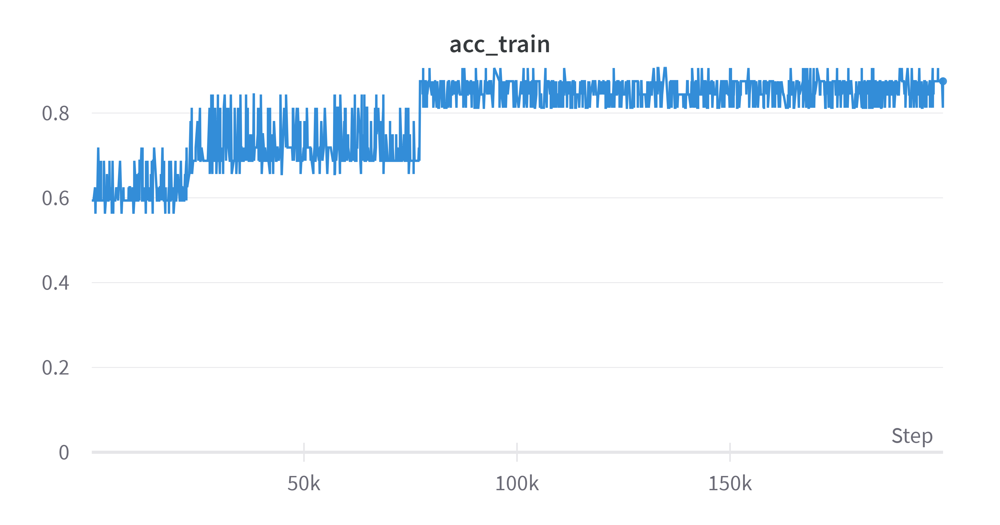

# VinoVigil 🍇👀

  

## Problem 💥

The American wine industry generates over <strong>$276 billion</strong> for the US economy.

Disease in wine grape crops can cost United States growers <strong>billions</strong> of dollars each year.

Detecting the presence of a virus or bacteria can be costly, too and in some cases, visual signs of disease aren't obvious until a year after an infection occurs. At that point, it can be too late to save the diseased vines. A few influential problems are caused by the following: 

* **Compromised Grape Quality:**
 Even if the grapes from a diseased vine look fine, their quality may be compromised. This can lead to wines with off-flavors, imbalances, or other undesirable characteristics.

* **Economic Impact:**
Reduced yield and quality directly translate to economic losses. The cost of treating diseases, combined with lower sales due to decreased volume and potential quality issues, can have a major impact on a vineyard's profitability.

* **Spread of Disease:**
 Some grape diseases are highly contagious and can spread quickly within a vineyard and to neighboring vineyards. This can lead to wider outbreaks that are difficult and expensive to control.

* <strong>Increased Vulnerability:</strong> Diseased plants often have weakened immune systems, making them more susceptible to other diseases or pests.

### Diseased Grape 

  

### Healthy Grape 

  

## Solution ✨

I will use <strong>Alexnet</strong> to help train the model with images and indetify diseased grapes. The pretrained network can classify images into 1000 object categories, such as keyboard, mouse, pencil, and many animals.

  

* **Image Collection:**
 Use drones or automated robotic systems to capture high-resolution images of the vineyards at regular intervals.

* **Data Labeling:**
For the initial training of the AI, a set of images with known disease statuses should be labeled by experts. This serves as the foundational data on which the AI model is trained.

* **Regular Monitoring and Prediction:**
 Continuously process new images from the vineyards through the AI model. If the AI detects potential disease signs, it can alert farmers immediately.

* **Integration with Actionable Insights:**
 Upon detection, integrate the AI system with a database that offers solutions, such as recommended treatments or interventions, ensuring that farmers can take prompt and effective action.

* **Continuous Learning:**
As the AI system processes more images and gets feedback from real-world results, continuously refine and train the model to improve its accuracy.

## Benefits 📈

* **Increased Yield:**
Early detection allows farmers to address the problem promptly, ensuring that a higher percentage of grapes reach maturity and can be harvested.

* **Cost Savings:**
By catching the disease early on, farmers can avoid expensive treatments or the cost of replacing large numbers of vines. This results in reduced operational costs and more profits.

* **Consistent Quality:**
A healthy grape crop leads to better wine quality. Early detection ensures that diseased grapes don't make it into the final product, maintaining the reputation and consistency of the wine.

* **Reduced Spread:**
By identifying and treating or removing diseased plants early, there's a lower chance of the disease spreading to neighboring vines or even neighboring vineyards.

* **Sustainable Practices:**
With precise disease detection, farmers can apply pesticides or treatments only where needed, reducing the environmental impact and ensuring more sustainable farming practices.

* **Consumer Trust:**
 Knowing that vineyards are employing advanced technologies to ensure the health of their crops can build trust among consumers, leading to brand loyalty and growth in sales.

## Results 

### Progress over Time

The graphs below indicate the training accuracy (`acc_train`) and loss over the course of the training runs:

### Accuracy 

  

### Loss

  

### Run Summary

- **Training Accuracy**: 87.5%
- **Loss**: 0.4695

The high training accuracy suggests that the model has learned to distinguish between diseased and healthy wine grapes effectively. This model could potentially aid in the automation of quality control in viticulture.

## Feature Maps
[Feature Maps](https://colab.research.google.com/drive/1ZvKVJI3__o9lKpgsmAVu5-IybdAzeMl-#scrollTo=mQb-EZfpq-N8)

The images above are the visualization of feature maps and filters from a convolutional neural network (CNN). In the context of VinoVigil and the detection of diseased grapes, here’s how this technology is applicable:

* **Feature Map Visualization:**
   The visualization of feature maps can help in understanding what the neural network is focusing on at each layer. By visualizing these feature maps, researchers and engineers can identify which patterns or textures the network is using to differentiate between healthy and diseased grapes.

* **Filter Analysis:**
   Filters in CNNs are designed to detect various features in the image, such as edges, textures, or specific shapes. By overlaying these filters on top of the corresponding feature maps, one can inspect what features are being detected and how they contribute to the final decision of the network. This can be particularly useful in fine-tuning the network to better recognize the signs of disease on the grapes.

* **Model Interpretability:**
   The ability to visualize and understand the intermediate steps of the CNN makes the model more interpretable. This is crucial for trust in AI applications in agriculture, as it allows viticulturists to understand and trust the AI's decision-making process.

* **Enhanced Diagnostics:**
   Beyond just identifying diseased grapes, the patterns recognized by the CNN might be indicative of specific types of diseases, their severity, or their progression, which can aid in diagnosis and treatment decisions.

* **Educational Use:**
   These visualizations can be used to educate vineyard workers and managers about the characteristics of different grape diseases and what the AI model looks for when scanning the vineyard.

While the CNN’s ability to visualize feature maps and filters does not directly affect the grapes or diseases, it greatly aids the development, understanding, and trust in AI systems like VinoVigil that are used to detect and manage these diseases.

## Data 📸
[Data Deck](https://docs.google.com/presentation/d/1bTsrdUj_3KlBQo007blyHTvqQSqNvJ2_SJgl7Zezm2o/edit#slide=id.g206f8279a60_0_0)

## Alexnet 📊
[Alexnet Loaded Slides ](https://colab.research.google.com/drive/1L-8bVJ0-T99Pp5kRNW-InyEWr4Jx9Yqr#scrollTo=_b4zIKeW2pgC)

## Pose
[Pose Machine](https://colab.research.google.com/drive/13TMawPpUDsY0cvz5eWPQUKZtbtOk-2_O#scrollTo=VHmTwACwFW-v)

Integrating a pose estimation model like MoveNet into VinoVigil can significantly broaden its capabilities, especially in areas involving human movement analysis. It offers a blend of accuracy, speed, and accessibility, making it a versatile tool for various applications.

### 1. Enhanced Vineyard Monitoring
- **Worker Safety and Efficiency:** MoveNet could be used to monitor the posture and movements of workers in the vineyard, ensuring they are using safe and efficient methods during harvesting or vine treatment.

### 2. Training and Education
- **Instructional Tools:** For training vineyard workers, MoveNet can help in creating educational tools that demonstrate proper techniques for grape handling, pruning, or applying treatments, reducing the risk of damaging the vines or fruit.

Have Questions? Contact us at castroh2020@fau.edu

